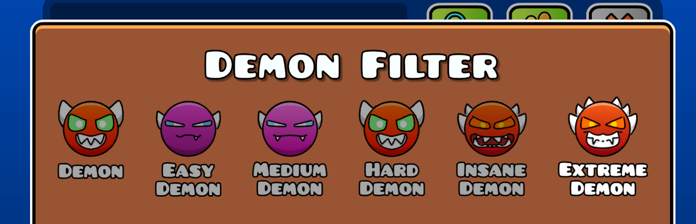

# [LEGACY] Cute Difficulty Faces

Old TPs will continue to be maintained to function with GD, though these textures will recieve lower priority compared to the newer versions. 
If the game recieves an update and the textures become bugged, you're very welcome to [submit a new version](https://github.com/slackwaree/cute-difficulty-faces-legacy/issues/new) before I do!

The newer, more modernized versions of this texture pack can be found [here](https://github.com/slackwaree/cute-difficulty-faces).

## Previews

</img>
</img>

## FAQ

> "It's not appearing in my texture loader after I installed it manually and not via the Texture Pack Workshop"

Unzip the contents of the file and remove `pack.json`.

> "Will you add support for XYZ?"

No.

> "Can I use these textures as part of my own mod/texture pack?"

Go for it! Please just be courteous and credit me if you can — even if it's just a footnote in a text file. DM me on discord (@realslacc) for full res sprites.
